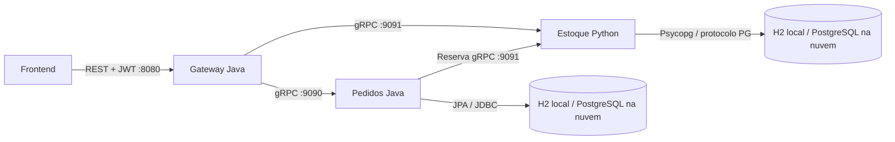
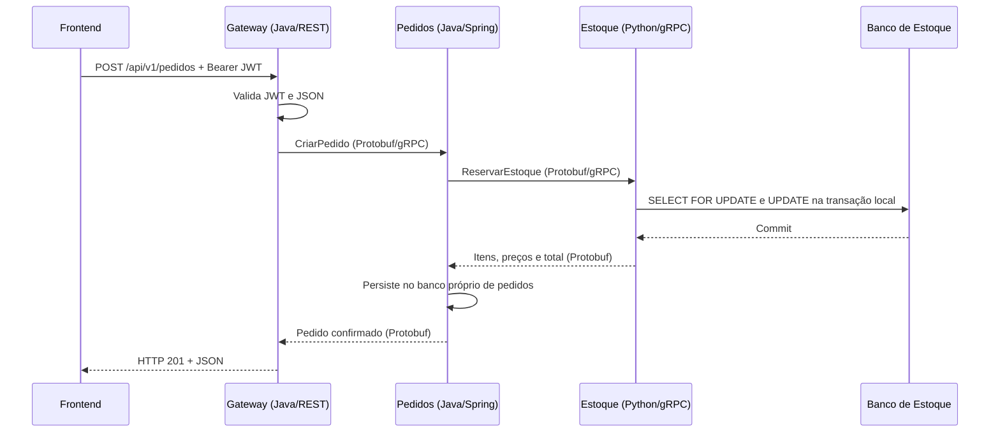

# E-commerce distribuído — versão final didática

Referência para o projeto final de Sistemas Distribuídos, na branch `versao-final`.
Pedidos e gateway permanecem em Java/Spring; estoque é inteiramente Python.
**A execução e a validação local usam H2. PostgreSQL é utilizado na nuvem.**
As telas preservam a interface da branch `aula-final`, sem Kafka ou mensageria.

## Arquitetura e tecnologias

Java 21, Maven Wrapper, Spring Boot 4.1, Spring MVC, Spring Security/JWT HS256,
Spring gRPC/Protobuf e JPA/Hibernate. Python 3.12+ com `grpcio`, `grpcio-tools` e
Psycopg. O frontend usa HTML, CSS e JavaScript puro.

| Componente | Responsabilidade | Porta |
|---|---|---|
| `api-gateway` (Java) | Serve frontend, autentica e converte REST/JSON em gRPC | 8080 HTTP |
| `pedido-service` (Java) | Cria e consulta pedidos do usuário; persiste via JPA | 9090 gRPC |
| `estoque-service` (Python) | Catálogo e reserva de estoque; SQL parametrizado | 9091 gRPC |
| `contratos-grpc` | Mesmo `.proto` utilizado para gerar Java e Python | Não é um processo |
| H2 do estoque, somente local | Banco persistente acessível ao Python pelo protocolo PG | 5435 |



Os dados pertencem a cada serviço: `pedidos` e `pedido_itens` no banco de pedidos;
`produtos` no banco de estoque. Não existem joins, chaves estrangeiras ou acesso direto
entre os bancos. O Python não contém Java, Spring ou JDBC. O H2 é um banco implementado
em Java que executa **em um processo separado**, acessado pelo Python pela rede.

O H2 oferece um subconjunto do protocolo PostgreSQL. Psycopg usa `ClientCursor` e
SQL parametrizado compatível com ambos, sem o dialect PostgreSQL do SQLAlchemy ou
prepared statements do protocolo estendido. O serviço mantém uma conexão por chamada,
com commit/rollback local e fechamento ao terminar. Não foi introduzido outro banco.

## Preparação

Pré-requisitos locais: JDK 21, Python 3.12+ com `venv`/`pip` e acesso à internet para
as dependências na primeira preparação. **Não é necessário instalar PostgreSQL,
`psql` ou Docker para executar localmente.** O driver H2 já está no jar de pedidos.
Execute os comandos a partir da raiz do repositório:

```bash
./mvnw -Dmaven.test.skip=true clean package
sudo apt install python3.13-venv
python3 -m venv estoque-service/.venv
estoque-service/.venv/bin/python -m pip install -e ./estoque-service
estoque-service/gerar-proto.sh
```

O Maven compila somente contratos, pedidos e gateway. As dependências Python vêm de
`estoque-service/requirements.txt`, lido pelo `pyproject.toml`. Os arquivos Protobuf
Python gerados e o `venv` são ignorados pelo Git. `clean` evita classes geradas antigas
ao alternar entre aulas. Nenhuma nova suíte de testes foi criada.

## Executar e validar localmente com H2

O perfil padrão é `local` nos dois serviços. Inicie em quatro terminais, nesta ordem:

```bash
# Terminal 1 — banco H2 do estoque, independente do serviço Python
scripts/h2.sh
```

```bash
# Terminal 2 — estoque Python, conectado ao H2 em localhost:5435
estoque-service/.venv/bin/python -m estoque.main
```

```bash
# Terminal 3 — pedidos Java, com H2 embutido próprio
java -jar pedido-service/target/pedido-service-0.0.1-SNAPSHOT.jar
```

```bash
# Terminal 4 — frontend e REST
java -jar api-gateway/target/api-gateway-0.0.1-SNAPSHOT.jar
```

Espere a mensagem `Estoque Python iniciado` e `Started ...` nos processos Java.
Pedidos cria suas tabelas por JPA; estoque cria `produtos` com `CREATE TABLE IF NOT EXISTS`.
Nenhum processo limpa ou popula dados automaticamente.

Na primeira execução, depois que as tabelas forem criadas, pare pedidos, estoque e
o servidor H2 com Ctrl+C e execute:

```bash
DEMO_ENV=local scripts/banco.sh popular h2
```

Reinicie os três componentes. Acesse **http://localhost:8080**, com **admin / admin**.
A demonstração pode ser verificada pela própria interface: consulte produtos, selecione
quantidades, confirme um pedido, abra os detalhes e observe a redução do estoque.
Pedidos e quantidades permanecem após reiniciar os processos.

Os arquivos locais são `data/pedidos_demo.mv.db` e `data/estoque_python_demo.mv.db`.
O primeiro é aberto apenas por pedidos; o segundo, apenas pelo processo H2. O nome
`estoque_demo` na conexão Python é um alias restrito a esse segundo arquivo.
A senha fictícia do estoque H2 é `sa` / `sa`; pedidos mantém `sa` com senha vazia.
Os arquivos antigos do estoque Java não são apagados ou convertidos automaticamente.

A população pode ser repetida: insere somente os exemplos ausentes, sem duplicar
pedidos ou itens e sem alterar preços ou repor estoque já consumido. Não exige limpeza
prévia. Para restaurar exatamente os dados e saldos iniciais, pare os três componentes
e execute a limpeza confirmada antes de popular:

```bash
DEMO_ENV=local scripts/limpar-dados.sh h2
# Digite LIMPAR DEMO quando solicitado.
DEMO_ENV=local scripts/banco.sh popular h2
```

Os scripts verificam os dois arquivos antes de alterar dados e usam `IFEXISTS=TRUE`.
Eles falham se um processo ainda mantiver um arquivo aberto. A limpeza exige
`DEMO_ENV=local` e a confirmação exata, apaga itens antes de pedidos e preserva as
tabelas e estruturas externas. Há uma transação por banco, sem transação distribuída.
Somente os destinos fixos de demonstração podem ser limpos. URLs personalizadas não
são interpretadas pelos scripts de administração.

## PostgreSQL na nuvem

Crie dois bancos no PostgreSQL disponibilizado pelo seu ambiente, um para cada
serviço. `scripts/sql/criar-bancos.sql` mostra a criação com nomes e credenciais
fictícios; adapte permissões e credenciais ao provedor. Não execute esse arquivo
repetidamente. Não use credenciais didáticas em uma implantação real.

Selecione explicitamente `cloud` e passe a conexão de cada processo:

```bash
# Estoque Python — PostgreSQL remoto, TLS habilitado por padrão
DB_PROFILE=cloud DB_HOST=SEU_HOST DB_PORT=5432 DB_NAME=estoque_demo \
DB_USER=SEU_USUARIO DB_PASSWORD=SUA_SENHA DB_SSLMODE=require \
GRPC_HOST=0.0.0.0 \
estoque-service/.venv/bin/python -m estoque.main
```

```bash
# Pedidos Java — banco próprio PostgreSQL
SPRING_PROFILES_ACTIVE=cloud \
DB_URL='jdbc:postgresql://SEU_HOST:5432/pedidos_demo?sslmode=require' \
DB_USER=SEU_USUARIO DB_PASSWORD=SUA_SENHA \
ESTOQUE_GRPC_TARGET=static://ENDERECO_ESTOQUE:9091 \
java -jar pedido-service/target/pedido-service-0.0.1-SNAPSHOT.jar
```

```bash
# Gateway — endereços dos processos na rede da implantação
PEDIDO_GRPC_TARGET=static://ENDERECO_PEDIDOS:9090 \
ESTOQUE_GRPC_TARGET=static://ENDERECO_ESTOQUE:9091 \
java -jar api-gateway/target/api-gateway-0.0.1-SNAPSHOT.jar
```

Em `cloud`, as credenciais são obrigatórias, sem fallback para o H2. Não há scripts
que limpem bancos remotos. Para inserir os exemplos na nuvem, use os SQLs de população
separadamente, com o cliente/procedimento do provedor e apenas em bancos de demonstração.
A implantação e a configuração de rede específicas do provedor não são automatizadas.

## Tabelas de uma versão anterior na nuvem

Se a conexão funcionar, mas aparecer `add column ... not null` seguido de
`contains null values`, o banco selecionado já contém uma tabela de outra versão.
O Hibernate tenta adicionar campos obrigatórios, mas não sabe preencher os registros
antigos. A mensagem posterior `column ... does not exist` é consequência dessa falha.
`ddl-auto=update` não realiza uma migração dos dados de negócio.

Para demonstrar a versão final sem alterar os registros antigos, crie bancos novos e
vazios pelo console do provedor ou por um cliente SQL, com permissão de criação:

```sql
CREATE DATABASE pedidos_versao_final;
CREATE DATABASE estoque_versao_final;
```

Execute cada comando fora de uma transação. Configure o Java com
`DB_URL=jdbc:postgresql://SEU_HOST:5432/pedidos_versao_final?sslmode=require`
e o Python com `DB_NAME=estoque_versao_final`. Os serviços criam suas próprias tabelas
na primeira inicialização; depois, os SQLs de população podem ser executados nos
respectivos bancos. O usuário configurado precisa ter permissão para criar tabelas.
Não use `ddl-auto=create` para corrigir um banco existente: essa opção pode apagar dados.

Se for necessário migrar os pedidos anteriores, primeiro inspecione o schema:

```sql
SELECT column_name, data_type, is_nullable
FROM information_schema.columns
WHERE table_schema = 'public' AND table_name IN ('pedidos', 'pedido_itens')
ORDER BY table_name, ordinal_position;
```

A migração depende das colunas e relacionamentos antigos: é necessário identificar
o usuário de cada pedido, seu total, moeda, data e itens antes de impor `NOT NULL`.
Não atribua todos os pedidos a `admin` nem invente totais para contornar o erro.
O serviço interrompe a inicialização quando a atualização do schema falha, evitando
anunciar o servidor gRPC como disponível com tabelas incompatíveis.

## Diagnóstico de conexão na nuvem

`psycopg.errors.ConnectionTimeout: connection timeout expired` significa que o driver
não concluiu a conexão no prazo. Isso acontece antes da criação de tabelas e do
servidor gRPC. O traceback sozinho não distingue bloqueio de rede, endereço incorreto
ou uma negociação de conexão/TLS que não terminou. Alterar o SQL ou o contrato gRPC
não resolve esse estágio.

Execute a verificação **na mesma máquina em que o estoque está sendo iniciado**:

```bash
DB_HOST=SEU_HOST DB_PORT=5432 python3 - <<'PYTHON'
import os
import socket

destino = (os.environ["DB_HOST"], int(os.environ["DB_PORT"]))
try:
    with socket.create_connection(destino, timeout=5):
        print("TCP acessível. Ainda é necessário validar PostgreSQL, TLS e autenticação.")
except OSError as erro:
    print(f"TCP indisponível: {type(erro).__name__}: {erro}")
    raise SystemExit(1)
PYTHON
```

Se o teste TCP falhar:

- **Cloud SQL com IP público:** confirme que `DB_HOST` é o IP público da instância
  SQL. Em conexões diretas, autorize o IP de saída da máquina que executa o serviço
  nas redes autorizadas da instância. Se o serviço está em uma VM, use o IP de saída
  dessa VM, não o IP do notebook utilizado para abrir o SSH. Confira também regras
  de saída aplicáveis à máquina.
- **Cloud SQL com IP privado:** a máquina precisa ter acesso à VPC/rede da instância.
  Defina `DB_HOST` com o endereço privado apropriado a essa rota.
- **PostgreSQL instalado em uma VM:** confirme que o servidor está rodando e ouvindo
  na porta esperada. Na VM do banco, `sudo ss -ltnp '( sport = :5432 )'` mostra o
  endereço de escuta. Conexões externas exigem listener adequado, firewall e regra
  `pg_hba.conf` para a origem específica. Se banco e estoque estão na mesma VM,
  prefira `DB_HOST=127.0.0.1` em vez do IP público dessa própria máquina.

Se TCP estiver acessível, verifique se o endpoint realmente atende PostgreSQL,
a política de TLS e eventuais certificados de cliente exigidos pelo provedor.
Com `psql` disponível, um diagnóstico completo pode ser feito sem colocar a senha
no comando:

```bash
psql 'host=SEU_HOST port=5432 dbname=SEU_BANCO user=SEU_USUARIO sslmode=require connect_timeout=5' -W
```

Mantenha TLS para conexões remotas; não desative `DB_SSLMODE` para tentar contornar
bloqueios de rede. `DB_CONNECT_TIMEOUT=15` permite mais tempo de negociação caso a
rede já esteja acessível, mas não libera firewall nem autoriza um IP bloqueado.
As regras da instância precisam ser ajustadas no ambiente de nuvem; mudar apenas
as variáveis de execução do Python não as altera.

Referências oficiais: [acesso Compute Engine → Cloud SQL](https://docs.cloud.google.com/sql/docs/postgres/connect-compute-engine)
e [diagnóstico de conectividade Cloud SQL](https://docs.cloud.google.com/sql/docs/postgres/debugging-connectivity).

## Configuração por ambiente

| Variável | Componente | Local / nuvem |
|---|---|---|
| `DB_PROFILE` | Python | `local` padrão; `cloud` para PostgreSQL |
| `SPRING_PROFILES_ACTIVE` | Pedidos | `local` padrão; `cloud` para PostgreSQL |
| `DB_HOST`, `DB_PORT`, `DB_NAME` | Python | `127.0.0.1`, `5435`, `estoque_demo` / conexão PostgreSQL |
| `DB_USER`, `DB_PASSWORD` | Python | `sa` / `sa` no H2; obrigatórios na nuvem |
| `DB_CONNECT_TIMEOUT` | Python | 5 segundos para abrir a conexão; mínimo 2 |
| `DB_SSLMODE` | Python cloud | `require`; configure `verify-full` e certificados se necessário |
| `DB_URL`, `DB_USER`, `DB_PASSWORD` | Pedidos cloud | URL JDBC e credenciais obrigatórias do PostgreSQL |
| `LOCAL_DB_URL` | Pedidos local | `jdbc:h2:file:./data/pedidos_demo;MODE=PostgreSQL;DATABASE_TO_LOWER=TRUE` |
| `H2_PG_PORT` | `scripts/h2.sh` | 5435; ao mudar, ajuste `DB_PORT` no Python |
| `GRPC_HOST`, `GRPC_PORT`, `GRPC_WORKERS` | Python | `127.0.0.1`, 9091, 4 |
| `GRPC_PORT` | Pedidos | 9090 |
| `ESTOQUE_GRPC_TARGET` | Pedidos/gateway | `static://localhost:9091` |
| `PEDIDO_GRPC_TARGET` | Gateway | `static://localhost:9090` |
| `SERVER_PORT` | Gateway | 8080 |
| `GRPC_DEADLINE` | Gateway | 5s; pedidos espera até 2s pelo estoque |
| `APP_USERNAME`, `APP_PASSWORD` | Gateway | `admin` / `admin` |
| `JWT_SECRET`, `JWT_EXPIRATION_SECONDS` | Gateway | Segredo didático e expiração de 3600s |
| `CORS_ALLOWED_ORIGINS` | Gateway | `http://localhost:3000,http://localhost:5173` |

`estoque-service/.env.example` exemplifica os valores locais e os ajustes para nuvem;
o arquivo não é carregado automaticamente. Exportações são específicas de cada
processo. O frontend usa `/api/v1`, acompanhando o gateway sem URL duplicada.
Em outra origem, ajuste `API_BASE` e CORS. Após mudar `web`, recompile o gateway.

Os SQLs de população mantêm três produtos e um pedido fictício de R$ 3.750,00.
Os saldos iniciais (9 notebooks, 19 teclados e 30 mouses) já descontam esse pedido.
Não há tabela de usuários: o login usa a credencial configurada no gateway.

## Interoperabilidade entre Java e Python utilizando gRPC

Microsserviços podem usar linguagens diferentes porque seu ponto de integração é
um contrato de rede. gRPC transporta chamadas e respostas por HTTP/2. Protocol Buffers
define os tipos das mensagens e sua serialização binária. Os serviços compartilham
o `.proto`, não classes Java, objetos Python ou modelos de banco.

O contrato é `contratos-grpc/src/main/proto/produto_estoque.proto`. Seus serviços,
métodos, campos e números foram preservados. Maven gera `EstoqueServiceGrpc` para
Java. `estoque-service/gerar-proto.sh` usa `grpc_tools.protoc` para gerar
`produto_estoque_pb2.py` (mensagens) e `produto_estoque_pb2_grpc.py` (cliente e servidor)
no pacote `estoque.generated`. O include virtual do script organiza os imports
Python sem editar arquivos gerados e sem mudar a rota `ecommerce.EstoqueService`.

Em `PedidoService.java`, o stub Java chama `reservarEstoque` com uma mensagem
`ReservarEstoqueRequest`. A rede entrega essa mensagem ao método `ReservarEstoque`
de `EstoqueGrpcService` em Python. A implementação valida os itens, consulta e atualiza
seu banco H2 ou PostgreSQL e devolve `ReservarEstoqueResponse`. gRPC serializa a resposta; o
cliente Java a desserializa e persiste o pedido. O gateway converte o resultado para
JSON, que a interface apresenta ao usuário.



O Java não conhece o SQL nem as funções internas do Python. O Python não conhece
as entidades JPA. Ambos conhecem apenas mensagens, métodos, endereço e códigos de
status gRPC. Para comparar em aula, abra o `.proto`, o stub utilizado em
`pedido-service/.../PedidoService.java` e `estoque-service/src/estoque/grpc_server.py`.

## Fluxos de funcionamento

1. **REST:** `fetch` em `web/app.js` centraliza o envio de JSON a `/api/v1`. O gateway
   recebe DTOs validados e transforma respostas gRPC em JSON.
2. **Autenticação:** `POST /api/v1/auth/login` recebe usuário/senha, verifica a
   credencial e retorna `accessToken`, `tokenType` e `expiresIn`. Só o JWT fica em
   `sessionStorage`. Cada chamada envia `Authorization: Bearer <token>`. Spring
   Security valida assinatura HS256 e expiração. Em 401, o frontend remove o token
   e volta ao login; sair também o remove. Não há sessão HTTP.
3. **Catálogo:** `GET /api/v1/produtos` e `GET /api/v1/produtos/{id}` viram chamadas
   gRPC do gateway Java para estoque Python, que abre sua conexão de banco.
4. **Pedido:** o carrinho envia `{ "itens": [{ "produtoId": "mouse", "quantidade": 2 }] }`
   para `POST /api/v1/pedidos`. O usuário vem do JWT validado, nunca do JSON.
5. **Reserva:** pedidos chama Python por gRPC. Python verifica itens distintos,
   quantidades positivas e saldo; bloqueia produtos em ordem de ID com `FOR UPDATE`
   e baixa todos na mesma transação. Qualquer falha desfaz todas as baixas.
   Preços usam `Decimal`/`NUMERIC` e strings Protobuf, sem arredondamento por `float`.
6. **Persistência:** o estoque confirma seu commit antes de responder. Java grava
   `Pedido` e `ItemPedido` via JPA; o gateway retorna 201 com `Location`. Listagem e
   consulta de pedidos acessam apenas os registros do sujeito autenticado.

O tratamento de erros usa um advice no gateway e códigos gRPC nas bordas. Python
usa uma única exceção simples para regras de negócio, registra falhas inesperadas
no log e fecha as conexões pelo gerenciador de contexto.

| Situação | HTTP |
|---|---|
| JSON, itens, quantidade ou ID inválido | 400 |
| Login incorreto ou JWT ausente, inválido ou expirado | 401 |
| Produto/pedido ausente ou pedido de outro usuário | 404 |
| Estoque insuficiente | 409 |
| Serviço ou banco de estoque indisponível | 503 |
| Prazo gRPC excedido | 504 |
| Falha inesperada de persistência/processamento | 500 |

## Limitações didáticas e validação

Reserva e gravação do pedido são transações locais independentes. Uma falha após
reservar pode deixar estoque baixado sem pedido. Um timeout pode ocorrer depois de
confirmar a transação. Python verifica o prazo antes de concluir a reserva, mas isso
não elimina a janela entre commit e resposta. Não há retries automáticos ou garantia
de execução exatamente uma vez: consulte os dados antes de repetir uma operação
incerta. Não foram acrescentados saga, transação distribuída ou broker.

O catálogo trabalha em BRL. Não há cadastro de usuários, pagamento, cancelamento,
reposição pela interface ou notificações. Os locks protegem concorrência no estoque,
sem tornar atômico o fluxo entre serviços. A criação automática de tabelas serve à
demonstração e não substitui um processo de migração de produção.

O fluxo **Java → gRPC → Python → H2** foi validado localmente com criação de pedido,
consultas, rollback, concorrência, reinício e interface no navegador. O perfil `cloud`
também foi exercitado em PostgreSQL isolado com TLS. Os comandos e resultados,
incluindo o que não foi executado, estão em
[docs/validacao-versao-final.md](docs/validacao-versao-final.md).
